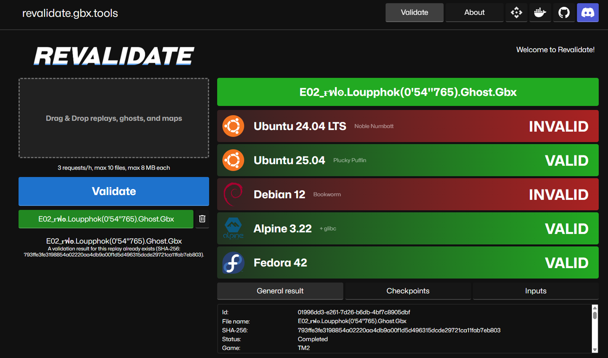

# Revalidate

Revalidate is a unified solution to validate Trackmania replays and ghosts remotely (aka: outside of the game).

Since 2003, Trackmania has had an ingame replay validation feature, but since Trackmania released in 2020, it has largely degraded - users cannot validate their replays ingame anymore. But it was found that some form of validation is still available.

Leaderboards maintained by Nadeo are mostly not automatically validated:
- In Trackmania (2020), leaderboards have an internal flagging system that probably uses replay validation, but moderation has improved only recently.
- In Trackmania 2, replay validation applies only to Top 10 records and is evaluated in the morning. Invalid records are automatically removed.
- In Trackmania Turbo, only the world record per platform is validated.
- In Trackmania United Forever, leaderboards don't use replay validation at all.

However, all of these games have some form of I/O replay validation available:

- Trackmania (2020) and Trackmania 2 replays can be validated through a dedicated server command. Convenient.
- Trackmania United Forever and Trackmania Turbo replays can be validated only with a GUI client executable command. Less convenient, but possible with a fake X server.

So, instead of focusing on a single Trackmania game, Revalidate handles TM2020 and TM2 (+ eventually TMUF) with no difference of user experience.

## How it works

Revalidate is a web API service that handles 4 stages:
1. Gathers replay, ghost, and map files from different Trackmania games via client uploads
2. Schedules validation tests on dedicated servers running as Docker containers
3. Retrieves standard output, links the results with the individual replay/ghost files
4. Stores the validation results in a database
5. Sends the validation results back to users

Ghosts can be validated alone on maps that are known and stored on Revalidate or retrievable externally, like TM2020 maps. For replays, you can opt in for validation against a different map than the one stored in the replay file. If not opted in, it is evaluated automatically. Beware that ghost exports from replays are still experimental.

## Web API

### Endpoints

TBD

## CLI

Planned in the future.

# Special thanks

- Auris
- Mystixor